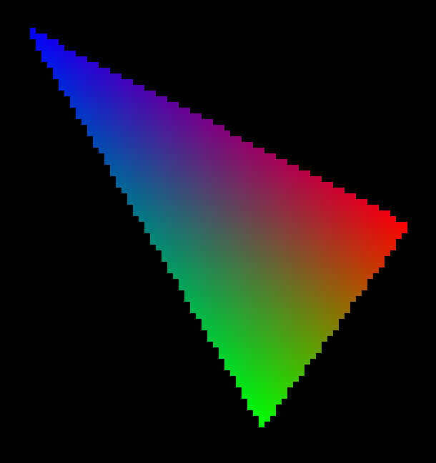
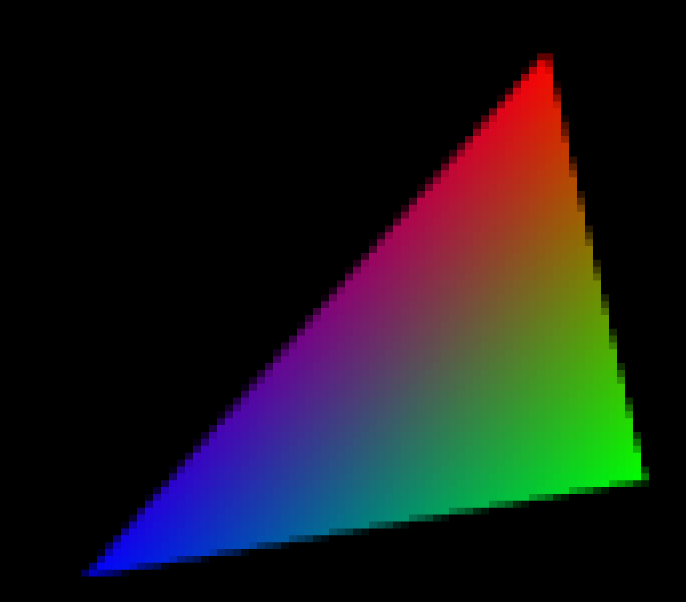

# Taller raster

## Propósito

Comprender algunos aspectos fundamentales del paradigma de rasterización.

## Tareas

Emplee coordenadas baricéntricas para:

1. Rasterizar un triángulo;
2. Implementar un algoritmo de anti-aliasing para sus aristas; y,
3. Hacer shading sobre su superficie.

Implemente la función ```triangleRaster()``` del sketch adjunto para tal efecto, requiere la librería [frames](https://github.com/VisualComputing/framesjs/releases).

## Integrantes

Máximo 3.

Complete la tabla:

| Integrante | github nick |
|------------|-------------|
| Juan David Quintero      | [DavidQP](https://github.com/davidqp)            |
| Romain Fontaine          | [romainfontaine](https://github.com/romainfontaine)            |


## Discusión

Describa los resultados obtenidos. Qué técnicas de anti-aliasing y shading se exploraron? Adjunte las referencias. Discuta las dificultades encontradas.
- Resultados obtenidos:




- Anti-alisasing:
  - Tecnica vista en clase - Subsampling: subdividir cada pixel en 16 zonas. La intensidad del color es proporcional al numero de zonas que pertenecen al triangulo.

- Shading:
  - Interpolación con las coordenadas baricentricas: cada nodo del triangulo tiene un color inicial. Los puntos dentro del triangulo tienen una proporcion de cada color dado su distancia a cada nodo.

- Referencias:
  - https://fgiesen.wordpress.com/2013/02/06/the-barycentric-conspirac/
  - https://fgiesen.wordpress.com/2013/02/08/triangle-rasterization-in-practice/ 

## Entrega

* Modo de entrega: [Fork](https://help.github.com/articles/fork-a-repo/) la plantilla en las cuentas de los integrantes (de las que se tomará una al azar).
* Plazo: 1/4/18 a las 24h.
